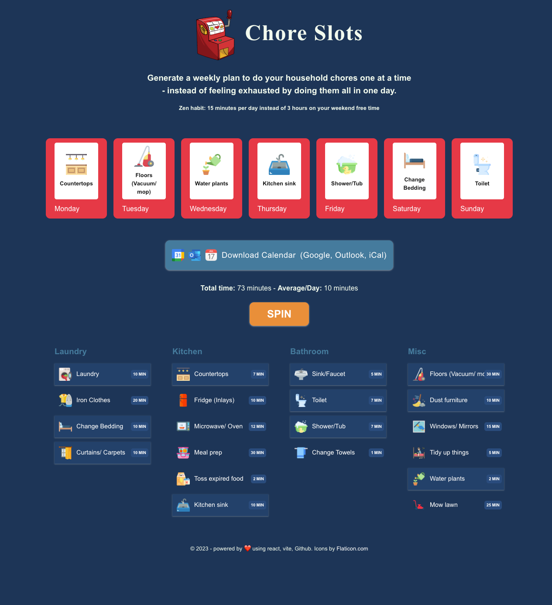

# ChoreSlots

Make household chores fun and easy by doing a little bit every day.

[Demo](https://nikoisonfire.github.io/)

## Key learnings

- Writing more type-safe React
- Using Vite as a build tool (it's amazing)
- Generating Calendar events via ics.js
- Github Workflows, building and cross-repo deploying to GitHub Pages (see demo)

## Tech stack

- React (obviously)
- [Zustand](https://github.com/pmndrs/zustand)
- [ics.js](https://github.com/nwcell/ics.js/)
